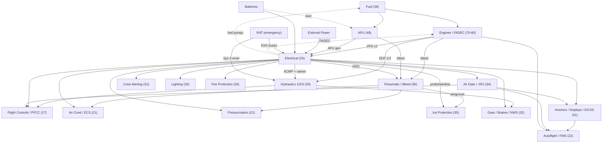

# A220 Systems — Pass 1: Inventory, Fidelity Tiers & Dependency Map

Global, shallow pass. Purpose: decide *what* to build, at *what* fidelity, in *what* order — before any per-system deep spec. Keep this file at the repo root (or `/docs`) and revise it against the manufacturer documentation; the tier and dependency calls below are a defensible starting point, not gospel.

---

## Fidelity tiers

| Tier | Name | What it means |
|------|------|---------------|
| **T1** | Simulated | Owns real internal state, runs its own state machines and transfer functions, drives downstream systems, and can model failures. Behaves like the real component. |
| **T2** | Behavioral | Produces correct externally-visible outputs and obeys the right logic, but internals are lumped/approximated. Switches and indications are real; you do not model every valve. |
| **T3** | Cosmetic | Controls and annunciators move and illuminate, but drive no real downstream state. Placeholder hooks, promotable later. |
| **T4** | Sim-default | Leave to X-Plane's built-in behavior, or omit. |

The discipline is forcing *every* chapter into a tier. That is what stops random coding — and, equally, stops you over-modelling a system nobody touches.

---

## System inventory (by ATA chapter)

| ATA | System | Tier | X-Plane 12 baseline | Custom study-level scope | Upstream dependencies |
|-----|--------|:----:|---------------------|--------------------------|-----------------------|
| 21 | Air Conditioning / ECS + Pressurization | **T1** | Basic cabin temp/pressure | IASC pack & bleed demand, cabin-alt schedule, outflow valve control, COND/PRESS synoptics | Pneumatic, Electrical |
| 22 | Auto Flight (AP/FD, A/THR, FMA) | **T2** | Autopilot + flight director | FMA mode logic & annunciation, A/THR engagement, mode transitions | Avionics, Air Data, Engines |
| 23 | Communications (VHF, audio, ACARS) | **T3** | Radios | Tuning hooks, audio panel state | Electrical |
| 24 | **Electrical** | **T1** *(root)* | Simplified buses/gens/batt | VFG ×2 / APU-gen / ext / RAT source ladder, bus-tie logic, TRU→DC, battery SoC, contactor commanded-vs-actual | Engines, APU, Ext pwr, Batteries, RAT |
| 26 | Fire Protection (eng/APU/cargo) | **T2** | Basic fire model | Detection loop logic, bottle/squib state, discharge & warnings | Electrical |
| 27 | **Flight Controls** (FBW, 3× PFCC) | **T1** | Surfaces + rudimentary FBW | Active-PFCC selection/failover, Normal/Alternate/Direct law, protections, spoiler/speedbrake logic, HSTAB pitch trim, sidestick priority | Hydraulics, Electrical, Air Data/IRU |
| 28 | **Fuel** | **T1** | Tanks + transfer | Pump states, feed/transfer/crossfeed logic, suction-feed fallback, quantity & CG | Electrical (pumps) |
| 29 | **Hydraulics** (Sys 1/2/3, PTU, RAT) | **T1** *(root)* | Simplified single model | Three independent systems, EDP/ACMP/PTU/RAT sources, per-system pressure & quantity, HYD synoptic | Engines (EDP), Electrical (ACMP), RAT |
| 30 | Ice & Rain Protection | **T2** | Basic anti-ice | Wing/cowl anti-ice valves on bleed; probe/window heat on electrical; ice detection | Pneumatic, Electrical |
| 31 | **Indicating / Crew Alerting** (EICAS, PFD, ND, MFD, synoptics) | **T1** | Default instruments | All custom displays + EICAS message engine + master caution/warning hierarchy | Electrical + reads all |
| 32 | Landing Gear (gear, brakes/BTMS, NWS, antiskid) | **T2** | Gear + brakes | Gear sequencing SM, brake-temp model, nose-wheel steering, antiskid, weight-on-wheels | Hydraulics, Electrical |
| 33 | Lights (ext + int) | **T2/T3** | Lights | Switch logic, bus dependency, auto-modes | Electrical |
| 34 | **Navigation** (4× ADSP, 3× IRU, radio nav) | **T1** | Nav radios + GPS | Air-data smart-probe model, IRU alignment, source selection feeding PFD/ND | Electrical |
| 35 | Oxygen (crew + pax) | **T3** | Minimal | Mask deploy on cabin-alt threshold, supply pressure | Pressurization |
| 36 | **Pneumatic / Bleed Air** | **T1** *(root)* | Bleed model | Engine + APU bleed sources, IASC control, manifold pressure, isolation valves | Engines, APU, Electrical |
| 38 | Water / Waste | **T4** | — | Skip | — |
| 45 | Central Maintenance (CMS) | **T4** | — | Skip (optional later) | — |
| 49 | APU | **T1** | APU model | Start-sequence state machine, gen + bleed availability, EGT/RPM, auto-shutdown logic | Fuel, Battery |
| 52 | Doors | **T3** | — | Open/closed state, door warnings | — |
| 56 | Windows | **T4** | — | (Heat handled under ATA 30) | — |
| 70–80 | **Powerplant** (engine, FADEC, start, ignition, reverser, indicating) | **T1** | Jet thrust model | FADEC/thrust-mode logic over XP, start sequence, N1/N2/EGT/FF indicating, reverser, accessory takeoffs (VFG/EDP/bleed) | Fuel, Electrical (FADEC), Pneumatic (start) |

**T1 set (≈8 systems):** Electrical, Hydraulics, Pneumatic, Powerplant, Fuel, Flight Controls, Air Systems (ECS/Press), Indicating/Nav. These are where the engineering effort goes. Everything else collapses to T2–T4.

---

## Dependency graph

Directed edges read "A's outputs are B's inputs / A powers or actuates B." Solid edges are steady-state dependencies; dotted edges are the cold-start back-edges (see cycle note).

### The cold-and-dark cycle

There is a genuine dependency cycle at the root: **Electrical** needs **Engines** (VFGs), Engines need **Fuel**, fuel pumps need Electrical, the **APU** needs battery power to start, and Electrical draws on the APU generator. This is not a modelling error — it is the real cold-start chain (battery → APU start → APU gen powers buses → engine start → VFGs online → APU off).

Three assumptions break it cleanly:

1. **Batteries are an unconditional source.** They are the seed — always available regardless of any other system. Evaluate them first.
2. **Fuel has a suction/gravity-feed fallback.** Engines can run with unpowered fuel pumps, so Fuel does not hard-depend on Electrical for the engines to start.
3. **FADEC self-sustains.** Above idle the engine's dedicated alternator/PMA powers its own FADEC, so a running engine does not depend on aircraft electrical.

At runtime the cycle is harmless because each system reads the **previous tick's** `AircraftState` for cross-dependencies. The update order below only minimises one-frame lag along the forward edges; the dotted back-edges legitimately use last-frame values.

---

## Update ordering (within the `Systems` step)

Topological order of the forward edges. Each system reads `AircraftState` (last tick for back-edges), computes, and writes only the fields it owns.

1. Fuel — quantity, pump availability
2. Powerplant / Engines — N1/N2/thrust from throttle + fuel; FADEC
3. APU — RPM/EGT; gen + bleed availability
4. Electrical — source ladder → bus states
5. Pneumatic / Bleed — manifold pressure
6. Hydraulics — per-system pressures
7. Air Data / IRU — sensor outputs
8. ECS / Pressurization / Ice Protection
9. Flight Controls — law selection, surface commands
10. Landing Gear / Brakes / NWS
11. Navigation / Autoflight / FMS
12. Crew Alerting / EICAS — consumes everything
13. Displays — pure read; render after state has settled

---

## Recommended build order

Producers go bottom-up; consumers (displays) run in parallel because they only read.

- **Phase 0 — done.** X-Plane boundary, dataref plumbing, `AircraftState`, debug overlay.
- **Phase 1 — Electrical.** Root of the graph. Forces your reusable component primitives (`Source`, `Bus`, `Contactor` with commanded-vs-actual). Seed sources = battery + external power so you can power up on the ground.
- **Phase 2 — Source feeders.** Engine interface (N2→VFG, EDP shaft), APU (gen + start SM), Fuel. These close the electrical source ladder so the bus states become real.
- **Phase 3 — Pneumatic/Bleed + Hydraulics.** Both hang directly off engines / APU / electrical. Reuse the valve/pump primitives.
- **Phase 4 — Air systems consumers.** ECS, Pressurization, Ice Protection (all IASC-governed).
- **Phase 5 — Air Data/IRU, then Flight Controls.** FBW needs hydraulics + electrical + air data all present to be meaningful.
- **Phase 6 — Gear/Brakes → Autoflight/FMS → Crew Alerting.**

**Displays / avionics: build in parallel from day one.** They only *read* `AircraftState`, so they never block on producers — they simply show more realistic values as each producer comes online. (This is exactly what the current PFD work is doing. Keep going; it is not "out of order.")

---

## A220-specific notes

- **Air systems are one controller.** Bleed, packs, and pressurization are governed together by the **Integrated Air System Controllers (IASC)**. Model them as a single controller owning ATA 21 + 36 logic rather than three separate boxes — it mirrors the real architecture and keeps the coupling honest.
- **PFCC.** Three identical Primary Flight Control Computers; only one is in command, auto-selected at power-up. For study level, model the *active* computer's law logic plus the selection/failover state machine — not three full computers. Sidesticks with priority/takeover (PTY) logic.
- **RAT is a shared emergency source.** It feeds Hydraulic System 3 *and* the AC ESS / DC ESS 3 electrical buses on total AC loss in flight. Place its state where both Electrical and Hydraulics can read it.
- **Hydraulics topology.** Three systems, no fluid transfer; only Sys 1↔2 share *power* via the PTU. Sys 3 is electric-pump primary (ACMP 3A/3B) with RAT backup — so Sys 3 depends on Electrical, not on an engine-driven pump.
- **Indicating terminology.** The A220 uses **EICAS + synoptic pages** (Collins heritage), not Airbus ECAM. The current `Displays/ECAM/` folder is Airbus naming — consider `EICAS/` (and a separate `CAS/` for the alerting engine) so the structure matches the real aircraft as you scale.
